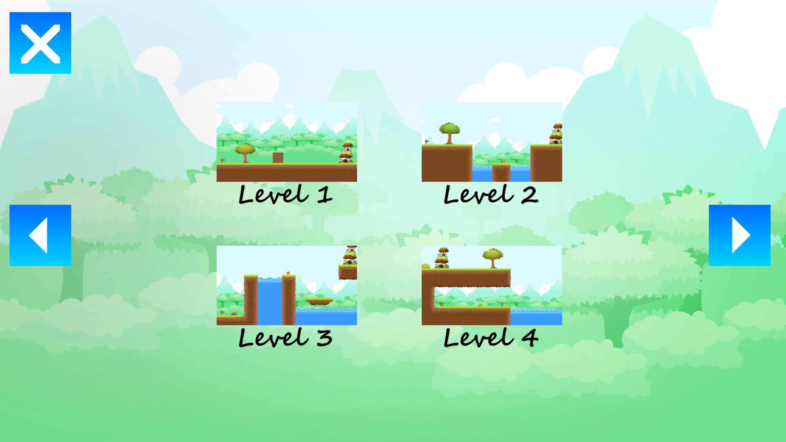
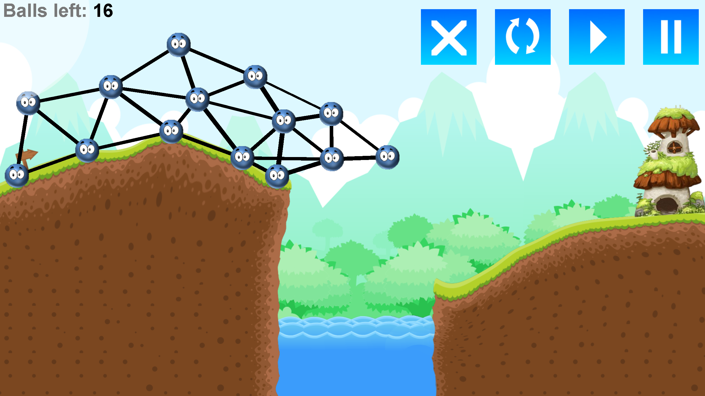
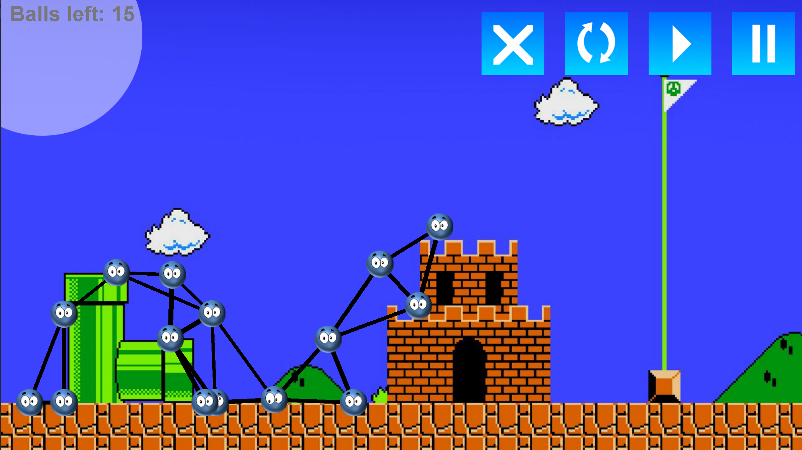
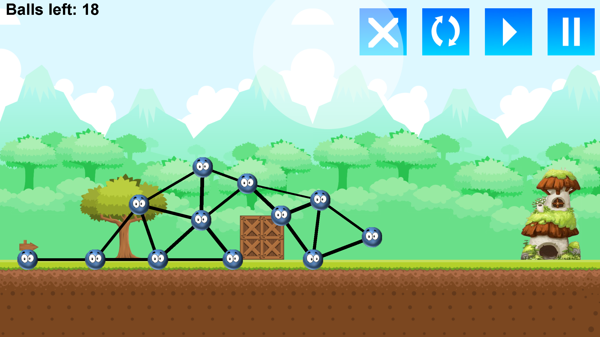

# Physics Game
A game featuring a manually programmed physics engine.

## Gameplay
- The aim is to guide a network of balls to the target area
- Players can only place new balls within the circle around mouse cursor
- The game concludes if any ball comes into contact with the water
- The balls are linked by springs, affecting their movement dynamics

## Screenshots

    
    

  
  

